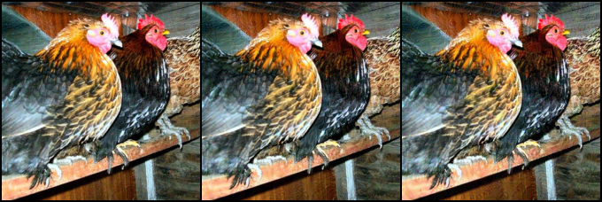

# Adversarial poison generation and evaluation.

This framework implements the data poisoning method found in the paper [**Adversarial Examples Make Strong Poisons**](https://arxiv.org/abs/2106.10807), authored by Liam Fowl, Micah Goldblum, Ping-yeh Chiang, Jonas Geiping, Wojtek Czaja, Tom Goldstein.


We use and adapt code from the publicly available [Witches' Brew](https://github.com/JonasGeiping/poisoning-gradient-matching.git) (Geiping et al.) github repository.


### Dependencies:
* PyTorch => 1.6.*
* torchvision > 0.5.*


## USAGE:

The cmd-line script ```anneal.py``` is responsible for generating poisons.

Other possible arguments for poison generation can be found under ```village/options.py```.
Many of these arguments do not apply to our implementation and are relics from the github repository
which we adapted (see above).



### CIFAR-10 Example

#### Generation
To poison CIFAR-10 with our most powerful attack (class targeted), for a ResNet-18 with epsilon bound 8, use
```python anneal.py --net ResNet18 --recipe targeted --eps 8 --budget 1.0 --target_criterion reverse_xent --save poison_dataset_batched --poison_path /path/to/save/poisons --attackoptim PGD```     

* Note 1: this will generate poisons according to a simple label permutation found in ```poison_generation/shop/forgemaster_targeted.py``` defined in the ```_label_map``` method. One can easily modify this to any permutation on the label space.

* Note 2: this could take several hours depending on the GPU used. To decrease the time, use the flag ```--restarts 1```. This will decrease the time required to craft the poisons, but also potentially decrease the potency of the poisons.

Generating poisons with untargeted attacks is more brittle, and the success of the generated poisons vary depending on the poison initialization much more than the targeted attacks. Because generating multiple sets of poisons can take a longer time, we have included an anonymous google drive link to one of our best untargeted dataset for CIFAR-10. This can be evaluated in the same way as the poisons generated with the above command, simply download the zip file from [here](https://drive.google.com/drive/folders/1dPvKzJWImoGZvBnRPqAx_3oa0EntKnhy?usp=sharing) and extract the data.


#### Evaluation
You can then evaluate the poisons you generated (saved in ```poisons```) by running
```python poison_evaluation/main.py --load_path /path/to/your/saved/poisons --runs 1```

Where ```--load_path``` specifies the path to the generated poisons, and ```--runs``` specifies how many runs to evaluate the poisons over. This will test on a ```ResNet-18```, but this can be changed with the ```--net``` flag.

### ImageNet

ImageNet poisons can be optimized in a similar way, although it requires **much** more time and resources to do so.
If you would like to attempt this, you can use the included ```info.pkl``` file. This splits up the ImageNet dataset into subsets of 25k
that can then be crafted one at a time (52 subsets in total). Each subset can take anywhere from 1-3 days to craft
depending on your GPU resources. You also need >200gb of storage to store the generated dataset.

A command for crafting on one such subset is:

```python anneal.py --recipe targeted --eps 8 --budget 1.0 --dataset ImageNet --pretrained --target_criterion reverse_xent --poison_partition 25000 --save poison_dataset_batched --poison_path /path/to/save/poisons --restarts 1 --resume /path/to/info.pkl --resume_idx 0  --attackoptim PGD```


You can generate poisons for all of ImageNet by iterating through all the indices (0,1,2,...,51) of the ImageNet subsets.

* Note: we are working to produce/run a deterministic seeded version of the above ImageNet generation and we will update the code appropriately.
